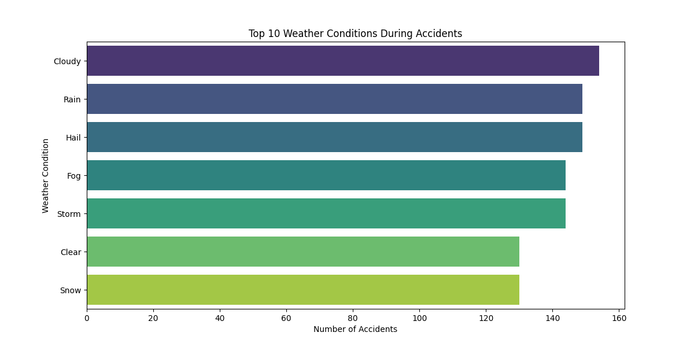
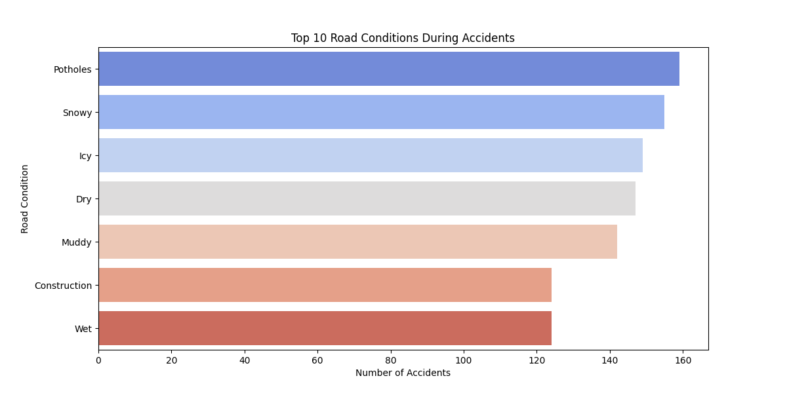
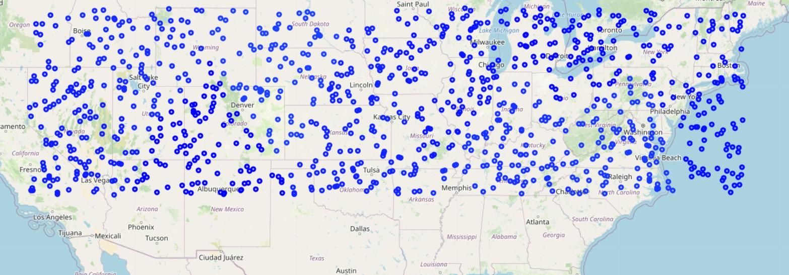
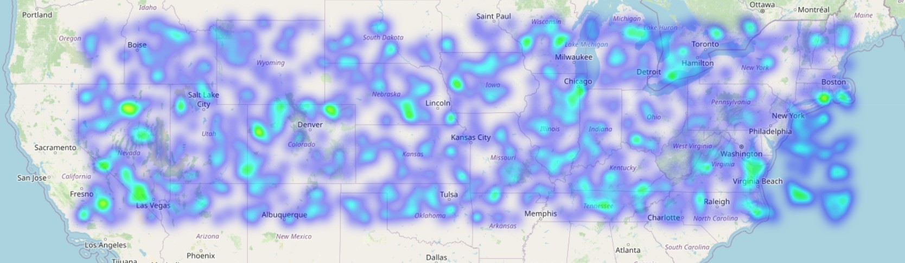
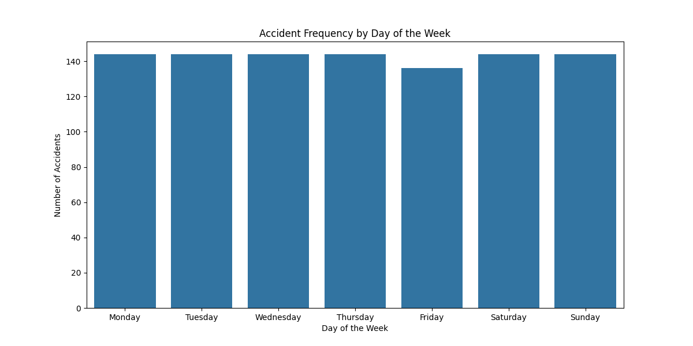
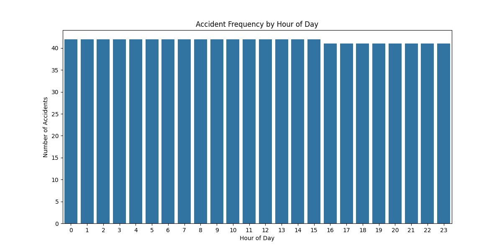

# Traffic Accident Data Analysis

This project analyzes traffic accident data to identify patterns related to road conditions, weather, and time of day. It also visualizes accident hotspots and contributing factors to gain insights into accident trends.

## Project Overview

The project involves:
1. **Data Cleaning**: Handling missing values and extracting relevant features.
2. **Exploratory Data Analysis (EDA)**: Analyzing accident trends based on time of day, weather conditions, and road conditions.
3. **Hotspot Visualization**: Creating heatmaps of accident locations.
4. **Clustering**: Identifying accident clusters using KMeans.
5. **Summary Statistics**: Generating statistical summaries of the data.

## Dataset

### Synthetic Dataset
A synthetic traffic accident dataset is used for this project, generated with features such as:
- `Start_Time`: Timestamp of the accident.
- `Start_Lat` and `Start_Lng`: Latitude and longitude of the accident.
- `Weather_Condition`: Weather conditions during the accident.
- `Road_Condition`: Road conditions during the accident.
- `Hour`: Hour of the day the accident occurred.
- `Day_of_Week`: Day of the week the accident occurred.

The synthetic dataset is available here : [Dataset](synthetic_traffic_accident_data.csv).


## Usage

1. Clone the repository:
   ```bash
   git clone <repository_url>
   cd <repository_directory>
   ```

2. Ensure the synthetic dataset [Dataset](synthetic_traffic_accident_data.csv) is in the project directory.

3. Run the analysis script:
   ```bash
   venv\Scripts\activate
   python analysis.py
   ```

4. View the generated outputs:
   - `accident_hotspots.html`: Heatmap of accident locations.
   - `cluster_map.html`: Cluster visualization of accident locations.
   - `cleaned_synthetic_traffic_accident_data.csv`: Cleaned dataset.

## Features

### Visualizations
- **Accident Frequency by Time of Day**: Bar plots showing accident counts by hour.
- **Accident Frequency by Day of the Week**: Bar plots showing accident counts by day.
- **Weather and Road Conditions**: Bar plots of top contributing conditions.

### Hotspot Mapping
- Interactive heatmaps and cluster maps to identify accident hotspots.

## Outputs
- **Heatmap of Accident Hotspots**: `accident_hotspots.html`
- **Cluster Map of Accident Locations**: `cluster_map.html`
- **Cleaned Dataset**: `cleaned_synthetic_traffic_accident_data.csv`

## Screenshots:








## Example Results
- Accidents are more frequent during rush hours.
- Wet and icy roads significantly contribute to accidents.
- Certain weather conditions like fog and storms increase accident likelihood.

## Contributing
Feel free to fork the repository and submit pull requests. Suggestions and improvements are welcome!

## License
This project is licensed under the [MIT License](LICENSE).

## Acknowledgments
Special thanks to the creators of libraries like pandas, seaborn, and folium for enabling robust data analysis and visualization.
